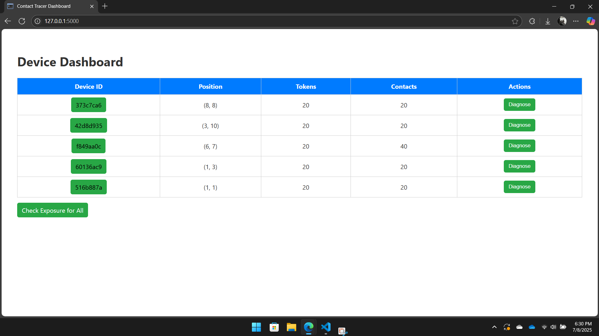
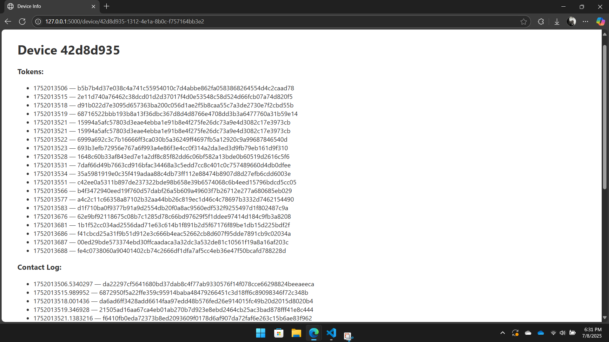
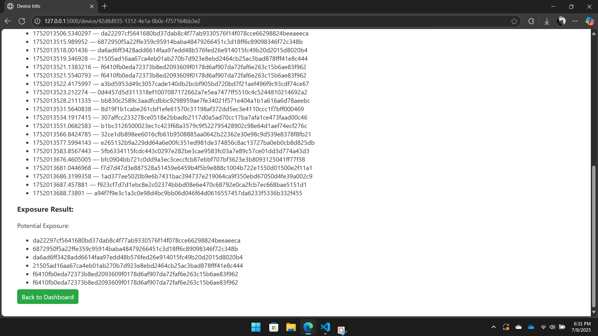
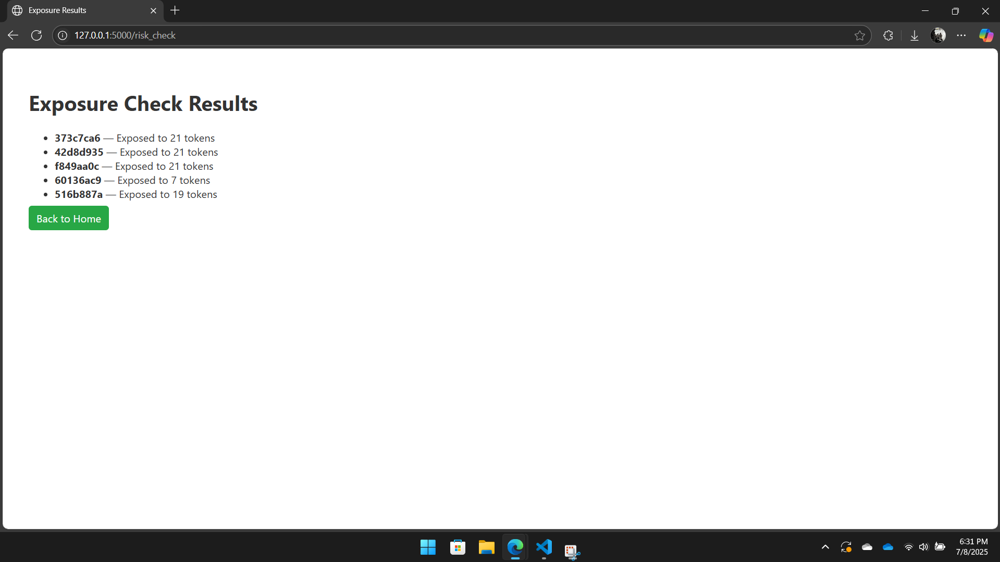

# Privacy-Aware Contact Tracer Simulation

A **Python Flask** simulation demonstrating the core principles of **privacy-preserving digital contact tracing** — similar to real-world systems like the Google/Apple Exposure Notification framework. 

---

## 🚀 Project Overview

The COVID-19 pandemic has popularized the need for digital contact tracing tools that help identify and notify people potentially exposed to infectious diseases — **while protecting user privacy**.

This project **models a simplified, local simulation** of such a system, illustrating how anonymous tokens are generated, exchanged, and used to evaluate exposure risk without revealing personal information.

---

## 🎯 What This Project Tries to Do

- **Simulate multiple user devices** randomly placed in a virtual 2D environment.
- Each device **generates rolling anonymous tokens** that change frequently to prevent tracking.
- Devices “broadcast” tokens and **log tokens received from nearby devices**, simulating Bluetooth proximity detection.
- Users (devices) can **upload their own tokens if diagnosed positive**, anonymously alerting others.
- The system **checks contact logs against diagnosis keys** to evaluate and report potential exposure.
- Provides a **clean, interactive Flask web dashboard** to visualize devices, tokens, contacts, and exposure status.
- Implements all logic in **pure Python** with a simple **HTML/CSS frontend (no JavaScript)**.

---

## 🔍 What the Project Actually Does

- Creates **5 simulated devices** positioned randomly on a 10x10 grid.
- Each device regularly generates new **SHA-256 hashed tokens** (simulating rolling Bluetooth IDs).
- Devices detect other devices within a **distance threshold** and record tokens they “receive.”
- When a device is diagnosed (via a dashboard button), its tokens are saved in a diagnosis key file.
- The system compares all devices’ contact logs against these diagnosis keys.
- Displays exposure results per device and summary reports in the web UI.
- Designed as a **local simulation**, no real Bluetooth or networking involved.

---

## 💡 Why This Matters

- Demonstrates the **privacy-first design** of real contact tracing apps — no personally identifiable info is shared.
- Provides hands-on understanding of **token generation, proximity detection, and exposure notification** protocols.
- A great example of modular Python web app architecture using Flask.
- Perfect for **learning, teaching, or showcasing skills** in cybersecurity, privacy, and backend development.

---

## Pictures

